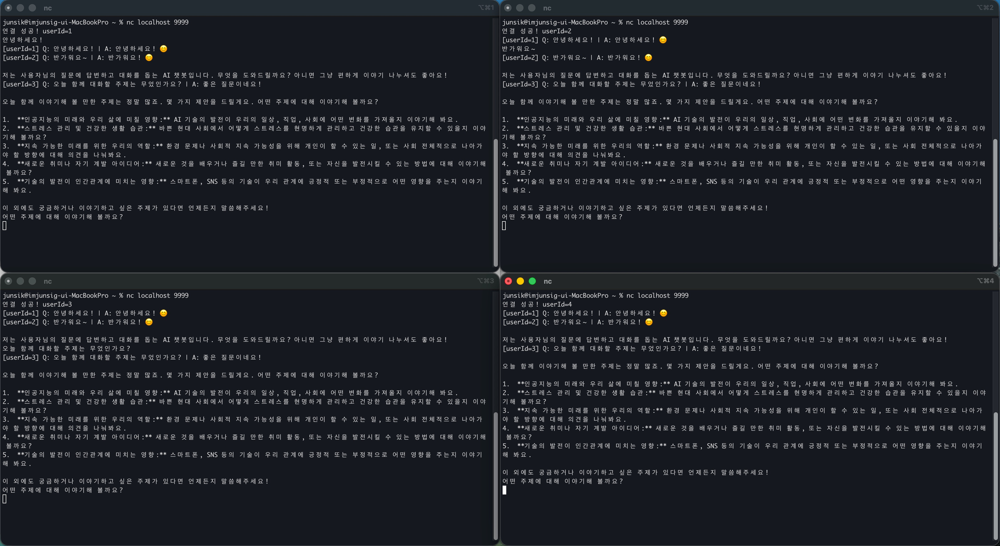
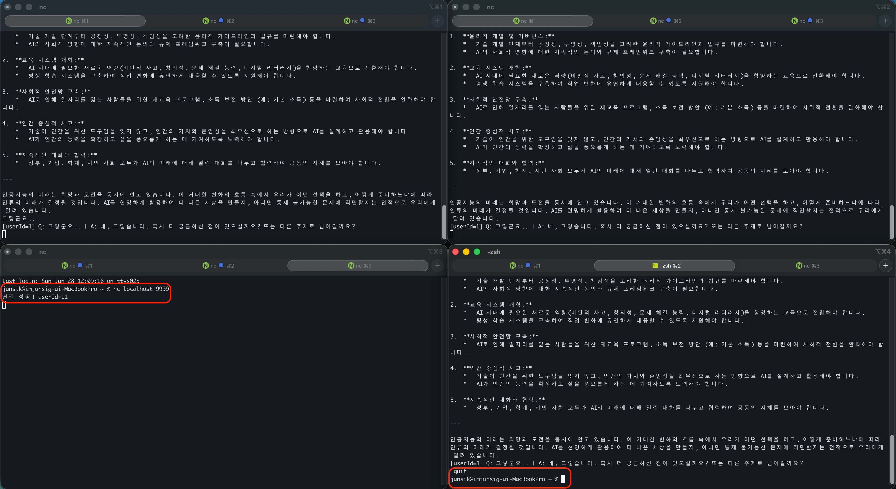
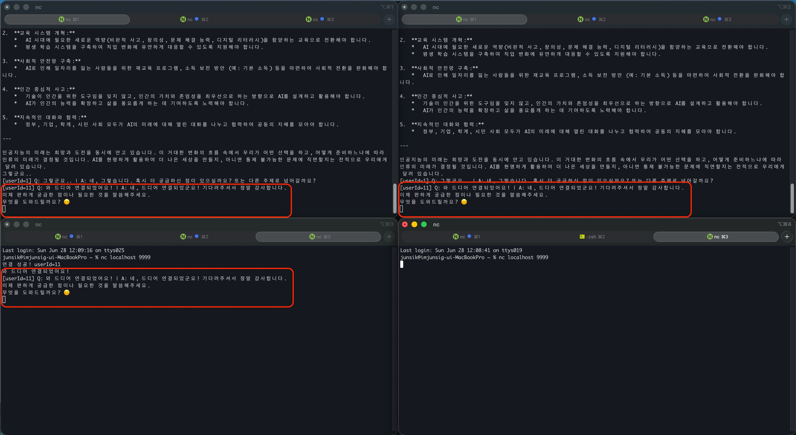

# Mission 2 - 메시지 큐 기반 대규모 AI 채팅 이력 파이프라인

## 실험 환경
- 서버: `week2.mission2.ChatServer` (스레드 풀 10개)
- 클라이언트: `nc localhost 9999` 4개 동시 접속
- AI 엔진: Gemini
- 로그 파일: `chat_history.log` (BufferedOutputStream, 8KB 청크)

## 브로드캐스트 동작 확인



4개 터미널이 모두 동일한 메시지를 수신하고 있다.

```
# 유저 1 터미널
연결 성공! userId=1
[userId=1] Q: 안녕하세요! | A: 안녕하세요! 😊
[userId=2] Q: 반가워요~ | A: 반가워요! 😊

# 유저 2 터미널
연결 성공! userId=2
[userId=1] Q: 안녕하세요! | A: 안녕하세요! 😊   ← 유저 1 메시지가 유저 2에게도 수신됨
[userId=2] Q: 반가워요~ | A: 반가워요! 😊

# 유저 3, 4 터미널도 동일하게 수신
```

## 로그 파일 저장 확인

`chat_history.log`에 타임스탬프와 함께 실시간 저장된 내역:

```
[2026-06-28 12:03:51] userId=1 | Q: 안녕하세요! | A: 안녕하세요! 😊
[2026-06-28 12:03:56] userId=2 | Q: 반가워요~ | A: 반가워요! 😊
[2026-06-28 12:04:16] userId=3 | Q: 오늘 함께 대화할 주제는 무었인가요? | A: 좋은 질문이네요! ...
```

## 스레드 풀 대기 큐 동작 확인

스레드 풀(10개)이 꽉 찬 상태에서 11번째 유저가 접속을 시도한 상황.

### 대기 상태 (스레드 풀 포화)



```
연결 성공! userId=11
와 드디어 연결되었어요 .
```

userId=11은 TCP 연결은 성공했지만 처리가 시작되지 않아 응답이 없는 상태로 대기했다.

### 처리 재개 (기존 유저 quit 후)



```
[userId=11] Q: 와 드디어 연결되었어요! | A: 네, 드디어 연결되었군요! 기다려주셔서 정말 감사합니다.
```

기존 유저가 `quit`으로 연결을 종료하자 빈 스레드가 생겨 userId=11의 처리가 즉시 시작됐다.

> `newFixedThreadPool`의 내부 `LinkedBlockingQueue`(무제한 대기 큐) 덕분에
> 11번째 접속이 거절되지 않고 대기 후 정상 처리됐다.

## 동작 원리

### ConcurrentHashMap 세션 관리

유저 연결 시 `sessions.put(userId, session)`, 종료 시 `computeIfPresent()`로 원자적 제거.
일반 `HashMap`과 달리 동시 접속/해제 시 데이터 무결성이 보장된다.

### 브로드캐스트

```java
sessions.forEach((userId, session) -> session.send(broadcastMsg));
```

`ConcurrentHashMap.forEach()`는 순회 중 세션 추가/제거가 발생해도 안전하게 동작한다.

### BufferedOutputStream 청크 단위 로그

```java
private static final int BUFFER_SIZE = 8192;  // 8KB
bos.write(entry.getBytes(StandardCharsets.UTF_8));
bos.flush();
```

8KB 버퍼로 시스템 콜을 최소화하고, 매 로그마다 `flush()`로 디스크에 즉시 반영해 무손실 저장을 보장한다.

## 결론

`ConcurrentHashMap` + `ExecutorService` + `BufferedOutputStream` 파이프라인으로
멀티 유저 채팅 이력을 스레드 안전하게 관리하고 실시간으로 디스크에 저장하는 시스템을 구현했다.
